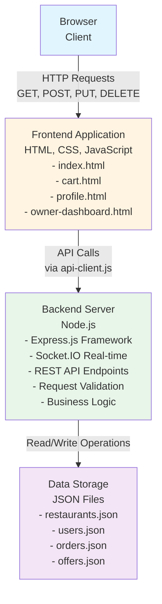
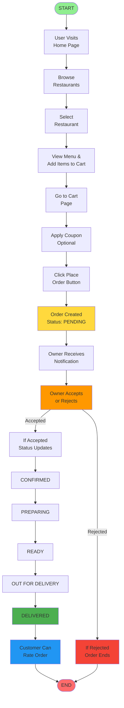

# DigiDine – Online Food Ordering & Restaurant Management System
## Complete Project Documentation

---

## 🔹 Overall Project Documentation

### 1. Objective

DigiDine is a complete online food ordering and restaurant management system designed to connect customers with restaurants in their area. The system solves the problem of finding good food, placing orders easily, and managing restaurant operations all in one place.

**Problems Solved:**
- Customers can browse multiple restaurants, see menus, and order food without calling restaurants
- Restaurant owners can manage orders, update menus, and track their business performance
- Real-time order updates keep both customers and owners informed
- Secure authentication ensures only authorized users can access the system

**Who Uses It:**
- **Customers**: Regular users who want to order food online, view restaurant menus, apply coupons, and track their orders
- **Restaurant Owners**: Business owners who want to accept orders, manage their menu items, view customer feedback, and see earnings

### 2. Functionality

DigiDine works as a complete web application with two main parts: the customer-facing website and the restaurant owner dashboard.

**How It Works:**
1. Customers visit the website, browse restaurants, and add food items to their cart
2. Customers can apply coupon codes to get discounts on their orders
3. After placing an order, customers can track order status in real-time
4. Restaurant owners receive new orders instantly and can accept, reject, or update order status
5. Owners can add, edit, or remove menu items from their restaurant
6. The system calculates prices, taxes, and delivery fees automatically
7. Both customers and owners can view order history and ratings

The entire system uses a backend server that handles all data storage, authentication, and real-time communication between customers and restaurants.

---

## 🔹 User Authentication System

### 1. Objective

The authentication system ensures that only registered and logged-in users can place orders, manage their profiles, and access owner features. It protects user data and provides secure access to different parts of the application.

### 2. Functionality

**User Registration:**
- New users can create an account by providing their name, email, and password
- Users can choose to register as a "customer" or "restaurant owner"
- If registering as an owner, users must provide restaurant name and location
- The system checks if the email already exists and prevents duplicate accounts
- After successful registration, users are automatically logged in and redirected to the appropriate page (home page for customers, dashboard for owners)

**Login:**
- Existing users enter their email and password to log in
- The system validates credentials against stored user data
- On successful login, user information is saved in browser storage
- Users are redirected based on their role (customers go to home page, owners go to dashboard)
- A welcome message appears briefly showing the user's name

**Logout:**
- Users can logout from any page using the logout button
- Logout clears all stored user data and cart items
- After logout, users are redirected to the login page
- Users must login again to access protected features

**Profile Management:**
- Logged-in users can view and edit their profile information
- Users can update their name, phone number, date of birth, and delivery address
- Profile picture can be uploaded and automatically compressed to save storage
- Changes are saved immediately and reflected across the application
- Email cannot be changed as it is used for account identification

**Authentication State Handling:**
- The system checks if a user is logged in on every page load
- If not logged in, users are redirected to login page when trying to access protected pages
- The navigation bar shows different options based on login status
- Logged-in users see their name or profile picture in the navbar
- Cart and order features require authentication before use

---

## 🔹 Restaurant Discovery Module

### 1. Objective

The restaurant discovery module helps customers find restaurants near them, see restaurant details, ratings, and filter restaurants based on their preferences. It makes it easy to browse and select a restaurant for ordering food.

### 2. Functionality

**Restaurant Listing:**
- The home page displays all available restaurants in a grid layout
- Each restaurant card shows restaurant image, name, cuisine type, location, rating, and delivery time
- Restaurant cards are clickable and take users to the restaurant's menu page
- Cards have a hover effect that slightly enlarges them for better user experience
- Images load with a skeleton animation while fetching from the server

**Ratings Display:**
- Each restaurant shows its average rating (out of 5 stars) with a star icon
- Ratings are displayed as a badge on each restaurant card
- Ratings are calculated from customer reviews and updated in real-time
- Higher rated restaurants are more visible to customers

**Cuisine Tags:**
- Each restaurant displays its cuisine type (e.g., Italian, Chinese, Indian)
- Cuisine information helps users quickly identify the type of food available
- Users can search restaurants by cuisine type using the search bar

**Veg-Only Filter:**
- On the restaurant menu page, users can toggle a "VEG ONLY" filter
- When enabled, only vegetarian items are displayed in the menu
- The filter works instantly without page reload
- A green switch button clearly indicates when the filter is active

**Search Functionality:**
- A search bar is available on the home page and in the navigation
- Users can search by restaurant name, cuisine type, or even food item names
- Search works in real-time as users type
- Search results update automatically showing matching restaurants
- If no results are found, a helpful message is displayed
- The search also looks inside restaurant menus to find specific dishes

**Rating Filter:**
- Users can sort restaurants by minimum rating (4.5+, 4.0+, 3.5+)
- The filter dropdown is located next to the search bar
- Filtering happens instantly and updates the restaurant list
- Users can combine search and rating filter for better results

---

## 🔹 Menu & Food Item Management

### 1. Objective

The menu management system displays all food items available at a selected restaurant. It shows item details, prices, and helps customers make informed choices before adding items to their cart.

### 2. Functionality

**Menu Loading Per Restaurant:**
- When a user clicks on a restaurant, the system loads that restaurant's complete menu
- Menu items are fetched from the backend server based on restaurant ID
- Menu displays in a clean list format with all item details
- If a restaurant has no menu items, a message is shown to the user

**Food Item Details:**
- Each menu item shows the item name, description, price, and image (if available)
- Item descriptions help users understand what they are ordering
- Items are displayed in a card format for easy reading
- Menu items are organized in a scrollable list

**Price Display:**
- Every item clearly shows its price in Indian Rupees (₹)
- Prices are displayed prominently next to each item
- Total price calculation happens automatically when items are added to cart

**Veg / Non-Veg Indicators:**
- Each menu item has a colored dot indicator
- Green dot (🟢) indicates vegetarian items
- Red dot (🔴) indicates non-vegetarian items
- The indicator appears next to the item name for quick identification
- Users can quickly scan the menu to find items matching their dietary preferences

**Add to Cart Button:**
- Each menu item has an "ADD" button
- Clicking the button adds the item to the cart
- If user is not logged in, they are prompted to login first
- A success message appears confirming the item was added
- The cart badge in the navbar updates immediately showing the item count

**Customer Reviews Display:**
- Below the restaurant header, customer reviews are shown in a scrolling marquee
- Reviews display customer name, star rating, and written feedback
- Reviews are fetched from delivered orders that have been rated
- The marquee continuously scrolls showing multiple reviews
- This helps customers see what others think about the restaurant

---

## 🔹 Cart System

### 1. Objective

The cart system allows users to collect food items from a restaurant before placing an order. It manages item quantities, calculates prices, applies discounts, and prepares the final bill for checkout.

### 2. Functionality

**Add to Cart:**
- Users click "ADD" button on any menu item to add it to cart
- If the cart is empty, the item is added immediately
- If cart already has items from a different restaurant, a warning popup appears
- Users can choose to clear the old cart and start fresh, or cancel the action
- Each item added increases the cart quantity badge in the navbar
- A success message appears confirming the item was added

**Remove Items:**
- Users can remove any item from the cart using a delete button (trash icon)
- Removing an item immediately updates the cart and recalculates totals
- If all items are removed, the cart shows an empty cart message
- The cart badge updates to show zero items

**Quantity Update:**
- Each cart item has plus (+) and minus (-) buttons to change quantity
- Clicking plus increases quantity by 1
- Clicking minus decreases quantity by 1
- If quantity reaches zero, the item is automatically removed from cart
- Price updates instantly as quantity changes
- The total price for each item (price × quantity) is displayed

**Dynamic Price Calculation:**
- The cart automatically calculates item total by multiplying price with quantity for each item
- Item total is the sum of all items in the cart
- Calculations happen in real-time as users modify the cart
- All prices are displayed in Indian Rupees (₹)

**Tax Calculation:**
- The system applies a 5% government tax on the item total
- Tax is calculated automatically and displayed separately
- Tax amount is rounded to the nearest rupee
- Tax is shown in the bill details section

**Delivery Fee Logic:**
- Delivery fee is ₹40 for orders below ₹500
- Orders above ₹500 get free delivery (₹0 delivery fee)
- Delivery fee is calculated automatically based on item total
- Free delivery is clearly indicated in the bill

**Final Bill Display:**
- The cart page shows a complete bill breakdown on the right side
- Bill shows: Item Total, Delivery Fee, Tax, Discount (if any), and Final Amount to Pay
- All amounts are clearly labeled and easy to read
- The final amount is highlighted in larger, bold text
- Bill updates automatically when cart changes

**Empty Cart Handling:**
- If cart is empty, a friendly message is displayed
- Empty cart shows an icon and message encouraging users to order
- A button redirects users back to restaurant listings
- Cart content area is hidden when cart is empty

**Restaurant Consistency:**
- Cart only allows items from one restaurant at a time
- If user tries to add items from a different restaurant, a confirmation popup appears
- This ensures orders are placed with a single restaurant
- Users must confirm before switching restaurants

---

## 🔹 Coupons & Offers System

### 1. Objective

The coupons and offers system provides discounts to customers, encouraging them to order more. It validates coupon codes, checks eligibility, and applies discounts to reduce the final bill amount.

### 2. Functionality

**Offers Page:**
- A dedicated "Offers" page displays all available coupons and promotions
- Each offer is shown in a card format with attractive design
- Offer cards display offer image, title, description, tag (like "New User"), and coupon code
- Users can browse all active offers in one place
- Offers are fetched from the backend server

**Coupon Eligibility:**
- Each coupon has specific conditions that must be met
- Conditions include: minimum order value, restaurant-specific restrictions, and expiry date
- The system checks all conditions before applying a coupon
- If conditions are not met, an error message explains why the coupon cannot be used

**Minimum Order Value Check:**
- Many coupons require a minimum order amount (e.g., ₹200, ₹500)
- The system compares cart total with minimum order requirement
- If cart total is less than required, coupon cannot be applied
- Error message clearly states the minimum order value needed

**Restaurant-Specific Coupons:**
- Some coupons work only for specific restaurants
- When user tries to apply such a coupon, system checks if current restaurant matches
- If restaurant doesn't match, coupon is rejected with an appropriate message
- General coupons work for all restaurants

**Expiry Validation:**
- Every coupon has an expiry date
- System checks if coupon has expired before applying
- Expired coupons are automatically filtered out from the offers page
- If user tries to apply an expired coupon, an error message is shown

**One-Click Apply Coupon:**
- On the offers page, each coupon has a "COPY" button
- Clicking copy button copies the coupon code to clipboard
- Button text changes to "COPIED!" for 2 seconds to confirm action
- On cart page, users can click "VIEW COUPONS" to see all available coupons
- A modal popup shows all coupons with eligibility status
- Users can click "APPLY COUPON" button on any eligible coupon
- Coupon code is automatically filled in the promo input field
- Coupon is validated and applied immediately

**Coupon Application Process:**
- User enters coupon code in the promo code input field on cart page
- User clicks "APPLY" button
- System sends coupon code to backend for validation
- Backend checks: code exists, not expired, restaurant matches, minimum order met
- If valid, discount is calculated and applied to bill
- Discount amount appears in bill breakdown
- Success message confirms coupon application
- If invalid, error message explains the reason

**Discount Calculation:**
- Two types of discounts: Percentage-based and Flat amount
- Percentage discount: Calculates discount as percentage of item total (e.g., 20% off)
- Flat discount: Deducts fixed amount (e.g., ₹100 off)
- Maximum discount limit may apply for percentage coupons
- Final discount is subtracted from total bill

**View Coupons Modal:**
- On cart page, "VIEW COUPONS" button opens a modal
- Modal displays all available coupons in a grid layout
- Each coupon card shows: code, title, description, and eligibility status
- Eligible coupons have active "APPLY COUPON" button
- Ineligible coupons are grayed out with reason displayed
- Clicking apply button automatically fills and applies the coupon

---

## 🔹 Order Placement System

### 1. Objective

The order placement system allows customers to finalize their cart, confirm order details, and place an order. It creates a new order record, sends notification to restaurant, and provides order confirmation to the customer.

### 2. Functionality

**Order Summary:**
- Before placing order, users can review complete order summary on cart page
- Summary shows: all items with quantities, individual prices, item total, delivery fee, tax, discount (if any), and final amount
- Users can modify cart items before proceeding to checkout
- All information is clearly displayed for user verification

**Address Selection:**
- Users can add or update their delivery address in profile section
- Address is stored in user profile and can be used for all orders
- Currently, system uses the address from user profile for delivery
- Address can be edited anytime from profile page

**Final Bill Generation:**
- System calculates final bill automatically including all charges
- Bill breakdown shows: Item Total + Delivery Fee + Tax - Discount = Final Amount
- All calculations happen in real-time
- Final amount is prominently displayed
- Users can see exactly what they are paying for

**Order Confirmation:**
- User clicks "PLACE ORDER" button on cart page
- System checks if user is logged in (redirects to login if not)
- System validates cart is not empty
- Order data is sent to backend server including: user email, items, restaurant ID, subtotal, discount, total, and promo code
- Backend creates new order with unique order ID
- Order status is set to "PENDING" initially
- Order is saved with current date and time
- Success message appears: "Order Placed! Redirecting..."
- User is automatically redirected to profile page to see order history
- Cart is automatically cleared after successful order placement

**Order Data Structure:**
- Each order contains: order ID, user email, restaurant ID, list of items with quantities, prices, subtotal, discount amount, final total, promo code used, order status, order date, and status history
- Order ID is unique and can be used for tracking
- Status history tracks all changes to order status over time

**Real-Time Notification:**
- When order is placed, restaurant owner receives instant notification
- Notification appears on owner dashboard if they are logged in
- Owner sees new order in "Incoming" tab immediately
- Customer also receives confirmation that order was received

**Error Handling:**
- If order placement fails, error message is displayed
- User can retry placing the order
- Cart items are preserved if order fails
- Common errors: network issues, server errors, invalid data

---

## 🔹 Order History

### 1. Objective

The order history feature allows customers to view all their past orders, see order details, track order status, rate completed orders, and reorder previous meals easily.

### 2. Functionality

**Viewing Previous Orders:**
- Order history is displayed on the user's profile page
- All orders are listed in reverse chronological order (newest first)
- Each order is shown in a card format with key information
- Orders are fetched from backend server based on user's email
- If user has no orders, a friendly message is displayed

**Order Details:**
- Each order card shows: restaurant name, order date and time, order status badge, list of items with quantities, total amount, and action buttons
- Order items are displayed as "quantity x item name" format (e.g., "2x Pizza, 1x Burger")
- Order total is prominently displayed
- Order date and time are formatted in readable format

**Order Status Display:**
- Each order shows current status with color-coded badge
- Statuses include: Pending (yellow), Confirmed (blue), Preparing (blue), Ready (green), Out for Delivery (orange), Delivered (green), Rejected (red)
- Status badge makes it easy to see order progress at a glance
- Status updates in real-time if owner changes order status

**Track Order Feature:**
- Each order has a "Track" button (for non-delivered orders)
- Clicking track opens a modal showing complete order timeline
- Timeline shows all status changes with timestamps
- Each status change displays: status name, date, time, and message
- Timeline is displayed in reverse order (latest status at top)
- Visual timeline with connecting lines shows order progression
- Order ID and customer email are also displayed in tracking modal

**Rate Order Feature:**
- Delivered orders show a "Rate" button if not yet rated
- Clicking rate opens a rating modal
- Modal shows restaurant name and asks for rating
- Users can select 1 to 5 stars by clicking on stars
- Stars highlight on hover and fill when clicked
- Users can optionally write feedback text
- Submit button is disabled until a star rating is selected
- After submission, rating is saved and restaurant's average rating is updated
- Rating cannot be changed once submitted
- Already rated orders show the rating as a badge instead of rate button

**Reorder Feature:**
- Every order has a "Reorder" button
- Clicking reorder adds all items from that order back to cart
- If current cart has items from different restaurant, confirmation popup appears
- User can choose to clear current cart and add reorder items
- After adding, user is redirected to cart page
- This makes it easy to order the same meal again

**Real-Time Updates:**
- Order status updates automatically when restaurant owner changes status
- If user is on profile page, order history refreshes automatically
- Toast notification appears when order status changes
- Updates happen in real-time using WebSocket connection

**Order Filtering:**
- Currently all orders are displayed together
- Orders are sorted by date (newest first)
- Each order is clearly separated with card design

---

## 🔹 Dark Mode UI

### 1. Objective

The dark mode feature provides users with an alternative color scheme that is easier on the eyes, especially in low-light conditions. It improves user experience and reduces eye strain during extended use.

### 2. Functionality

**Theme Toggle:**
- A theme toggle button is located in the navigation bar on all pages
- Button displays a moon icon (🌙) when in light mode
- Button displays a sun icon (☀️) when in dark mode
- Clicking the button instantly switches between light and dark themes
- Theme change applies to entire page including all elements

**Theme Persistence:**
- User's theme preference is saved in browser's local storage
- When user returns to the website, their last selected theme is automatically applied
- Theme persists across all pages of the website
- No need to select theme again on each visit

**Visual Changes in Dark Mode:**
- Background colors change from white/light to dark shades
- Text colors invert to maintain readability (dark text becomes light)
- Buttons and cards adapt to dark theme colors
- Navigation bar changes to dark background
- All UI elements maintain proper contrast for readability
- Images and icons remain visible with appropriate adjustments

**Theme Application:**
- Dark mode applies to: navigation bar, page background, cards, buttons, text, forms, modals, and footer
- Brand colors remain consistent in both themes
- Hover effects and animations work in both themes
- All interactive elements remain functional and visible

**Smooth Transition:**
- Theme switch happens instantly without page reload
- CSS transitions make the change smooth and pleasant
- No flickering or loading delays during theme change

---

## 🔹 Restaurant Owner Module

### 1. Objective

The restaurant owner module provides restaurant owners with a complete dashboard to manage their business. Owners can view incoming orders, accept or reject orders, update order status, manage menu items, view customer feedback, and track business performance.

### 2. Functionality

**Owner Login:**
- Restaurant owners register with role "owner" during registration
- Owners must provide restaurant name and location during registration
- System automatically creates a restaurant entry for new owners
- Owners login using same authentication system as customers
- After login, owners are redirected to owner dashboard (not customer home page)
- Owner dashboard is only accessible to users with "owner" role

**Dashboard Overview:**
- Owner dashboard has a sidebar navigation with multiple sections
- Sections include: Orders, Manage Menu, Analytics, Feedbacks, and Profile
- Dashboard shows owner's name in the top navigation bar
- Each section can be accessed by clicking sidebar links
- Active section is highlighted in sidebar

**Order Management:**
- Orders section has three tabs: Incoming (Pending), Active Processing, and Order History
- Incoming tab shows all new orders waiting for owner's response
- Active Processing tab shows orders being prepared or out for delivery
- Order History tab shows completed or rejected orders
- Each order card displays: order ID (last 6 digits), order time, order total, list of items, current status, and action buttons

**Accept Order:**
- Pending orders show "ACCEPT" and "REJECT" buttons
- Clicking accept changes order status to "CONFIRMED"
- Owner receives confirmation message
- Order moves from Incoming tab to Active Processing tab
- Customer receives real-time notification that order was accepted
- Order status history is updated with acceptance timestamp

**Reject Order:**
- Pending orders can be rejected by clicking "REJECT" button
- Rejection opens a modal asking for rejection reason
- Owner can select from predefined reasons or write custom reason
- Predefined reasons include: "Restaurant is busy", "Items out of stock", "Closing soon"
- After providing reason, owner confirms rejection
- Order status changes to "REJECTED"
- Customer receives notification that order was rejected
- Rejected orders appear in Order History tab

**Update Order Status:**
- Active orders show "MARK AS [NEXT STATUS]" button
- Status progression: CONFIRMED → PREPARING → READY → OUT FOR DELIVERY → DELIVERED
- Owner can only move status forward sequentially (cannot skip steps)
- Clicking status update button changes order to next status
- Each status change is recorded with timestamp and message
- Customer receives real-time notification of status change
- Order moves to appropriate tab based on new status

**Menu Management:**
- Manage Menu section displays all current menu items in a table
- Table shows: item image, name, description, category (Veg/Non-Veg), price, and status
- Owner can add new items, edit existing items, or delete items

**Add Menu Item:**
- "Add Item" button opens a modal form
- Form fields: Item Name, Price, Type (Veg/Non-Veg), Description, Image URL
- Owner fills all required fields and clicks "SAVE ITEM"
- New item is added to restaurant menu immediately
- Item appears in menu table and is visible to customers

**Edit Menu Item:**
- Each menu item has an edit button (pencil icon)
- Clicking edit opens the same modal with fields pre-filled
- Owner can modify any field (name, price, type, description, image)
- Changes are saved and reflected immediately
- Customers see updated menu on next page refresh

**Delete Menu Item:**
- Each menu item has a delete button (trash icon)
- Clicking delete shows confirmation popup
- After confirmation, item is removed from menu
- Deleted items no longer appear to customers
- Deletion is permanent

**Earnings Visibility:**
- Analytics section shows business overview
- Displays: Total Orders count and Total Revenue amount
- Revenue is calculated from all delivered orders
- Statistics update automatically when new orders are delivered
- Revenue is displayed in Indian Rupees (₹) with proper formatting

**Customer Feedbacks:**
- Feedbacks section shows all customer ratings and reviews
- Owner can filter feedbacks by rating (5 stars, 4 stars, etc.) or view all
- Statistics show: Total Feedbacks count, Average Rating, and Rating Distribution
- Rating distribution shows count and percentage for each star rating (1-5)
- Each feedback card displays: customer name, order ID, order total, star rating, written feedback (if any), and date
- Feedbacks are sorted by most recent first
- This helps owners understand customer satisfaction and improve service

**Real-Time Order Notifications:**
- When customer places new order, owner receives instant notification
- Notification appears as toast message on dashboard
- If owner is on Incoming tab, order list refreshes automatically
- Notification shows order ID and prompts owner to check incoming orders
- This ensures owners don't miss new orders

**Order Rating Display:**
- Completed orders that have been rated show the rating and feedback
- Rating appears as stars (★★★★★) with numeric value
- Written feedback is displayed in a highlighted box
- This helps owners see customer satisfaction for each order

---

## 🔹 Backend System Documentation

### 1. Objective

The backend system serves as the central server that handles all data operations, user authentication, order processing, coupon validation, and real-time communication. It stores all information, processes requests from the frontend, and ensures data security and consistency.

### 2. Functionality

**Server Role:**
- Backend server runs on Node.js using Express framework
- Server listens on port 5000 (or port specified in environment)
- Server handles all HTTP requests from frontend application
- Server manages data storage using JSON files (simulating database)
- Server provides REST API endpoints for all frontend operations

**API Handling:**
- All API endpoints follow RESTful conventions
- Endpoints use appropriate HTTP methods: GET (fetch data), POST (create), PUT (update), PATCH (partial update), DELETE (remove)
- API responses are in JSON format
- Error responses include clear error messages
- Server validates all incoming data before processing

**Authentication Logic:**
- User registration endpoint creates new user account
- System checks for duplicate emails before registration
- Passwords are stored (in production, should be encrypted)
- Login endpoint validates email and password
- On successful login, server returns user data and authentication token
- Token is used to identify logged-in users (currently mock token)
- Profile update endpoint allows users to modify their information
- Password change endpoint validates current password before updating

**Cart & Order Processing:**
- Cart operations are handled on frontend using browser storage
- Order placement endpoint receives complete order data
- Server validates order data (user email, items, restaurant ID, totals)
- Server generates unique order ID using timestamp
- Order is saved with status "PENDING" and current timestamp
- Order includes complete item list, prices, subtotal, discount, and final total
- Status history array tracks all order status changes
- Order history endpoint returns all orders for a specific user

**Coupon Validation Logic:**
- Coupon validation endpoint receives: coupon code, restaurant ID, and cart subtotal
- Server checks if coupon code exists in offers database
- Server validates coupon expiry date
- Server checks if coupon is restaurant-specific and matches current restaurant
- Server verifies minimum order value requirement
- If all validations pass, server returns coupon details
- Frontend calculates discount based on coupon type (percentage or flat)

**Database Interactions:**
- Server uses JSON files to store data: restaurants.json, users.json, orders.json, offers.json
- All read operations fetch data from JSON files
- All write operations update JSON files
- Data is persisted across server restarts
- Server handles file read/write errors gracefully

**Real-Time Communication:**
- Server uses Socket.IO for real-time updates
- When new order is placed, server emits event to restaurant owner's room
- When order status changes, server emits event to customer's room
- Rooms are created based on restaurant ID (for owners) and user email (for customers)
- This enables instant notifications without page refresh

**Order Status Management:**
- Server enforces sequential status progression
- Status flow: PENDING → CONFIRMED → PREPARING → READY → OUT_FOR_DELIVERY → DELIVERED
- Server prevents skipping status steps
- PENDING orders can be moved to CONFIRMED or REJECTED
- REJECTED is final status and cannot be changed
- Each status change is recorded with timestamp and message

**Restaurant Management:**
- Owner registration automatically creates restaurant entry
- Restaurant data includes: ID, name, location, cuisine, rating, menu items
- Menu management endpoints allow owners to add, update, or delete menu items
- Restaurant details can be updated by owner
- Rating system updates restaurant average rating when customers rate orders

**Rating System:**
- Customers can rate delivered orders (1-5 stars)
- Server validates: order exists, order is delivered, order belongs to customer, order not already rated
- Rating is saved to order record
- Restaurant's total rating and rating count are updated
- New average rating is calculated and saved
- Rating affects restaurant's displayed rating on frontend

**Data Migration:**
- Server runs migration on startup to ensure data consistency
- Migration adds missing status history to old orders
- Migration initializes rating counts for restaurants
- This ensures backward compatibility with existing data

**Error Handling:**
- Server validates all inputs before processing
- Missing required fields return 400 (Bad Request) error
- Invalid data returns appropriate error messages
- Not found resources return 404 error
- Unauthorized access returns 403 error
- All errors include descriptive messages for debugging

**Health Check:**
- Server provides health check endpoint (/api/health)
- Health check returns server status, timestamp, and environment info
- Useful for monitoring server availability

---

## 📊 System Diagrams

### 1️⃣ Backend System Architecture Diagram

**Explanation:**
This diagram shows how the DigiDine system is structured. The user's web browser (client) displays the frontend pages. When users interact with the website (clicking buttons, filling forms), the frontend JavaScript code makes API calls to the backend server. The backend server processes these requests, reads or writes data to JSON files (which act like a database), and sends responses back to the frontend. The frontend then updates what the user sees on the screen. Socket.IO enables real-time updates so changes appear instantly without refreshing the page.

---

### 2️⃣ Product Workflow Diagram

**Explanation:**
This diagram shows the complete journey of an order from start to finish. First, a user visits the website and browses restaurants. They select a restaurant, view the menu, and add food items to their cart. Then they go to the cart page where they can optionally apply a coupon code for discount. When ready, they click "Place Order" button. The system creates a new order with status "PENDING". The restaurant owner receives a notification about the new order. The owner can either accept or reject the order. If rejected, the order ends. If accepted, the order status progresses through stages: CONFIRMED (owner accepted), PREPARING (kitchen is cooking), READY (food is ready), OUT FOR DELIVERY (delivery person picked up), and finally DELIVERED (customer received food). At each stage, the customer receives real-time updates. After delivery, the customer can rate the order and restaurant. This completes the order cycle.

---

## ✅ Conclusion

DigiDine is a complete online food ordering and restaurant management system that successfully connects customers with restaurants. The system provides an easy-to-use interface for customers to browse restaurants, order food, apply discounts, and track orders. Restaurant owners have a powerful dashboard to manage orders, update menus, and view business analytics. The backend server handles all data operations securely and provides real-time updates to both customers and owners. The system is designed with user experience in mind, featuring dark mode, responsive design, and intuitive navigation. All features work together seamlessly to create a smooth food ordering experience from start to finish.

